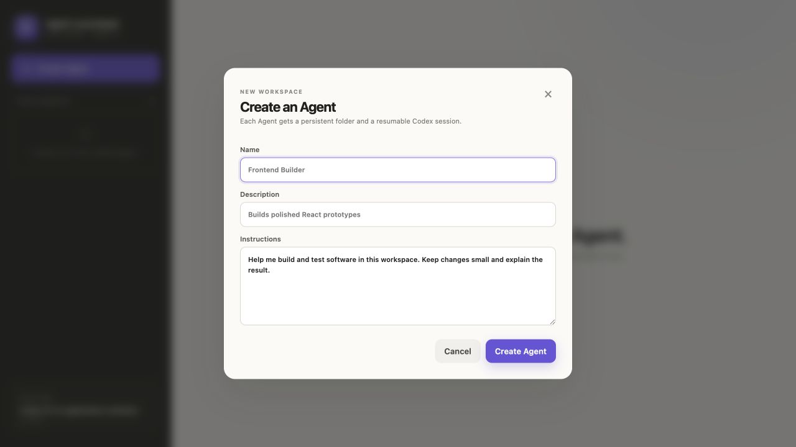
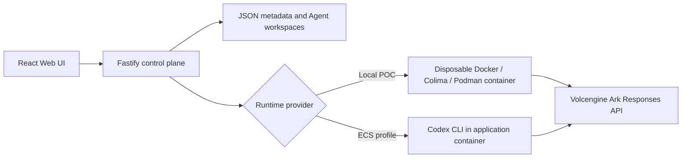

# Volc Agent Launchpad

A minimal Agent platform for three-day middleware hackathons. It provides Agent
CRUD, a browser Playground, persistent workspaces, and Codex CLI backed by the
Volcengine Ark Responses API.

Run it locally with Docker, Colima, or rootless Podman, or deploy it to
Volcengine ECS.

> [!WARNING]
> This is a single-user proof of concept. It intentionally has no identity,
> tracing, audit, or hardened sandbox middleware. Do not use production data or
> credentials. See [SECURITY.md](SECURITY.md).

## TechJam Track 1: the orchestration middleware

**The Agent-specific problem.** A single powerful coding Agent re-reasons over
broad and growing repository context on every turn, so cost climbs with
repository size rather than with task size. Naive multi-Agent delegation is
often worse: workers duplicate context, interfaces drift mid-flight, retries
accumulate, and an integrator quietly recreates the monolithic context at the
end. Nothing in the platform decides *when delegation is actually worth it*, and
nothing proves afterwards whether it helped.

**The solution, in one sentence.** This project adds middleware that treats
model intelligence and context as schedulable Agent resources: a powerful
planner confirms global intent with the user, then the control layer routes
local work to appropriately priced models with only the context each one needs,
under versioned contracts, hard budgets, trusted verification, and measured
direct-versus-orchestrated evidence.

**What the Starter Kit already provided**, and what still works unchanged: Agent
create/edit/start/stop/delete, the direct Playground with multi-turn Codex
sessions, asynchronous Run polling, persistent per-Agent workspaces, atomic JSON
persistence, disposable container execution, cancellation, timeouts, resource
limits, and restart reconciliation. The middleware is added beside these, not on
top of them.

### Execution modes

The Playground gains one control with three modes:

| Mode | What happens |
| --- | --- |
| **Direct** | The existing Playground path, unchanged. Best for small or tightly coupled work, and it is the benchmark baseline. |
| **Auto** | The planner elaborates intent and you confirm it; the router then still decides between direct execution, one worker, or several workers. Auto choosing *direct* is a normal, valid outcome. |
| **Orchestrated** | Forces delegation when the confirmed contract can be decomposed within budget, and fails safely when it cannot. |

Auto and Orchestrated always pause for explicit confirmation before any code is
written. Confirmation is never inferred from a model message or from opening the
screen.

### What you can see and control

- the planner's interpretation: goal, requirements, assumptions, non-goals,
  architecture decisions, open material questions, and manual expectations;
- a token and estimated-dollar range with its assumptions, plus the hard budget,
  *before* you confirm;
- the route decision and its reason, the task graph, and per-task allowed paths;
- what context each worker received: file count, hashes, and byte and token
  estimates, never the file contents;
- shared artifact versions, stale dependants, and focused refreshes;
- worker-visible, protected, global, and manual verification records kept apart;
- per-role token usage, model IDs, model calls, attempts, expansions,
  escalations, integration failures, wall-clock time, and estimated cost;
- a correlated, filterable evidence timeline;
- cancel, revise, confirm, confirm/reject amendment, start, and
  return-to-direct controls at every stage.

See [docs/ARCHITECTURE.md](docs/ARCHITECTURE.md#orchestration-middleware) for the
one-page diagram and trust boundaries, [docs/DEMO.md](docs/DEMO.md) for the
three-minute walkthrough, and [docs/THREAT_MODEL.md](docs/THREAT_MODEL.md) for
assets, boundaries, and residual risks.

## Screenshots

### Agent Playground


### Create an Agent



## Features

- React and TypeScript Web UI
- Agent create, edit, start, stop, delete, and multi-turn chat
- Fastify control plane with asynchronous Run state
- Persistent Agent workspaces and Codex sessions
- Disposable Docker, Colima, or Podman container for each local turn
- Docker and Terraform deployment paths for Volcengine ECS

## Requirements

- Node.js 22+
- npm 10+
- Docker, Colima, or Podman
- A Volcengine Ark API key and endpoint that supports the Responses API

Codex CLI is included in the Runtime image and is not required on the host.

## Local browser SOP

### 1. Check the local tools

Install Node.js 22+ and one supported container engine, then verify them:

```bash
node --version
npm --version
docker --version        # Docker Desktop, Docker Engine, or Colima
podman --version        # Use this instead when running Podman
```

Only one container engine is required. Codex CLI is already included in the
Runtime image.

### 2. Clone the repository

```bash
git clone <repository-url> volc-agent-launchpad
cd volc-agent-launchpad
```

Skip this step when already working from the repository root.

### 3. Start the POC

```bash
ARK_API_KEY=your-ark-api-key \
ARK_MODEL=ep-your-endpoint-id \
npm run poc
```

The first run installs Node.js dependencies and builds the Runtime image. The
script automatically selects Docker, Colima, or Podman.

### 4. Open the browser

Visit <http://localhost:3000>, or open it from the terminal:

```bash
open http://localhost:3000       # macOS
xdg-open http://localhost:3000   # Linux desktop
```

In the Web UI:

1. Select **Create Agent**.
2. Enter a name, description, and workspace instructions.
3. Select **Create Agent** again.
4. Enter a task in the Playground, for example:

   ```text
   Create a TypeScript hello-world CLI, add a test, and run it.
   ```

The Agent can write files, run commands, and continue the same Codex session in
later messages.

### 5. Stop and resume

Press `Ctrl+C` in the startup terminal. The script removes temporary Runtime
containers but keeps Agent workspaces and conversations.

- macOS state: `~/.volc-agent-launchpad/`
- Linux state: `.local/`
- Custom location: set `LOCAL_POC_DATA_ROOT`

Run the same `npm run poc` command to continue later.

### Select a specific container engine

Force Podman when multiple engines are installed:

```bash
CONTAINER_ENGINE=podman \
ARK_API_KEY=your-ark-api-key \
ARK_MODEL=ep-your-endpoint-id \
npm run poc
```

Colima uses `CONTAINER_ENGINE=docker` because it exposes the Docker CLI.

For a clean Linux host, follow the
[rootless Podman setup](docs/LOCAL_POC.md#rootless-podman-on-linux).

## Docker Compose

Create and edit the configuration:

```bash
./scripts/bootstrap-local.sh
```

Required values in `.env`:

```dotenv
ARK_API_KEY=your-ark-api-key
ARK_MODEL=ep-your-endpoint-id
APP_AUTH_TOKEN=replace-with-at-least-24-random-characters
```

Start the application:

```bash
docker compose up --build
```

Open <http://localhost:3000>. Stop it without deleting Agent data:

```bash
docker compose down
```

## Development

```bash
npm install
cp .env.example .env
npm install --global @openai/codex@0.111.0
npm run dev
```

- Web UI: <http://localhost:5173>
- API: <http://localhost:3000>

Use local paths in `.env` when running outside Docker:

```dotenv
APP_DATA_DIR=.data
AGENT_WORKSPACE_ROOT=workspaces
CODEX_HOME=codex-home
```

## Deployment

- [Existing Linux ECS with Docker](docs/DEPLOYMENT.md#existing-linux-ecs)
- [Complete Volcengine environment with Terraform](docs/DEPLOYMENT.md#terraform-deployment)
- [Local Docker, Colima, and Podman details](docs/LOCAL_POC.md)

The existing-ECS script deploys from the current source tree:

```bash
cp .env.example .env.production
./scripts/deploy-existing-ecs.sh .env.production
```

The Terraform path provisions VPC, subnet, security group, ECS, and EIP:

```bash
cp deploy/volcengine/terraform.tfvars.example \
  deploy/volcengine/terraform.tfvars
./scripts/deploy-volcengine.sh
```

## Configuration

| Variable | Default | Purpose |
| --- | --- | --- |
| `ARK_API_KEY` | Required | Ark model API key. |
| `ARK_MODEL` | Required | Responses-capable endpoint or model ID. |
| `ARK_BASE_URL` | Beijing v3 endpoint | Ark OpenAI-compatible API URL. |
| `APP_AUTH_TOKEN` | Empty on loopback | Shared demo token; use 24+ random characters remotely. |
| `RUNTIME_PROVIDER` | `local-process` | `container` for disposable local Runtime containers. |
| `CODEX_SANDBOX_MODE` | `workspace-write` | Codex inner sandbox mode. |
| `CODEX_TIMEOUT_MS` | `600000` | Maximum duration of one turn. |
| `LOCAL_POC_DATA_ROOT` | Platform-specific | Local metadata, workspace, and session directory. |

See [.env.example](.env.example) for all Runtime and resource-limit options.

### Orchestration configuration

Every orchestration setting is optional. With none of them set, one configured
Ark endpoint serves all four logical roles, estimated dollars stay unknown, and
the default hard budget applies.

| Variable | Default | Purpose |
| --- | --- | --- |
| `ORCHESTRATION_PLANNER_MODEL` | `ARK_MODEL` | Model ID for the planner role. Same pattern for `_WORKER_`, `_VERIFIER_`, `_INTEGRATOR_`. |
| `ORCHESTRATION_MODEL_PRICING` | Empty | JSON map of model ID to USD per million tokens. Missing entries keep estimated dollars `null`. |
| `ORCHESTRATION_MAX_MODEL_CALLS` | `40` | Hard call limit. Also `_MAX_STEPS`, `_MAX_WORKER_ATTEMPTS`, `_MAX_CONTEXT_EXPANSIONS`, `_MAX_WALL_CLOCK_MS`. |
| `ORCHESTRATION_MAX_INPUT_TOKENS` | Unset | Hard token limit. Unset means no hard limit for that dimension. |
| `ORCHESTRATION_MAX_ESTIMATED_USD` | Unset | Hard estimated-dollar limit, applied only when pricing is configured. |
| `ORCHESTRATION_CLEANUP_POLICY` | `archive` | `cleanup`, `archive`, or `retain` for temporary worker state. |
| `PROTECTED_EVALUATOR_ROOT` | Under `APP_DATA_DIR` | Mode-0700 store for protected acceptance checks. Never mounted into a worker. |

Model IDs, prices, and paths are trusted server configuration. None of them is
ever accepted from a browser value.

**Pricing honesty.** If a model has no configured price, the API reports
`pricingStatus: "unknown"`, the UI shows `Pricing not configured`, and only
token totals are compared. The product says *estimated cost*, never *billed
cost*. If the installed Codex CLI cannot override the model per role, every role
truthfully records the fallback Ark model in its evidence rather than implying a
multi-model saving that did not happen.

## How it works



The first turn uses `codex exec`; later turns resume the stored Codex thread.
Deleting an Agent archives its workspace under `workspaces/.deleted/`.

See [docs/ARCHITECTURE.md](docs/ARCHITECTURE.md) for component and extension
boundaries.

## Demo

Both scenarios and their expected evidence are in [docs/DEMO.md](docs/DEMO.md).
In short:

**Normal path.** Select an Agent, choose **Auto** or **Orchestrated**, submit a
modular task, read and revise the planner's interpretation, confirm contract v1,
watch the route decision and per-task context packets, then follow isolated
worker edits, a shared artifact version, deterministic integration,
protected/global verification, and the verified publish. Finish on the timeline
and the per-role usage and estimated-cost table.

**Failure and recovery path.** Rerun with a deliberately tiny budget (for
example `ORCHESTRATION_MAX_MODEL_CALLS=2`). The budget gate denies the next
reservation, the orchestration ends in `budget-exhausted` with the exact stop
reason, nothing is published, the main Agent workspace is untouched, and the
Agent returns to a truthful `ready` state. Cancel and restart behave the same
way: interrupted work is reconciled to `cancelled` with a reason and is never
reported as success.

## Benchmark: does orchestration actually help?

`POST /api/agents/:agentId/benchmarks` runs the same task twice and reports the
result honestly.

- Both arms start from **two isolated copies of one workspace snapshot** and get
  the identical prompt and confirmed criteria.
- The second arm never sees the first arm's output.
- **Quality is reported before cost.** If the two arms did not reach the same
  verified quality, or did not run the same trusted checks, the cost verdict is
  withheld entirely rather than declaring the cheaper arm the winner.
- Token totals are reported separately from estimated dollars. Unknown pricing
  yields tokens plus `Pricing not configured`.
- Comparability warnings record model differences, pricing assumptions, snapshot
  mismatches, cancellation, and the fact that each arm is a single sample run
  sequentially on one host.

**A result where direct execution wins is valid evidence and is displayed as
such.** Run at least one small, tightly coupled task (which should favour
direct) and one modular task (which may favour delegation) before drawing any
conclusion.

## Cleanup and recovery

- Temporary worker state follows `ORCHESTRATION_CLEANUP_POLICY`; the choice made
  for each task is recorded and shown in the evidence panel.
- Cleanup only ever targets resolved, task-specific paths. It never runs against
  `/`, a home directory, a workspace root, an unresolved variable, or a glob; an
  unsafe target is refused and the directory is retained for manual review.
- On restart, interrupted orchestrations, benchmarks, and Runs are reconciled to
  `cancelled` with a restart reason. Contracts, safe events, verification
  summaries, and usage are retained.
- Failed global verification leaves the main Agent workspace unchanged.
- Deleting an Agent cancels its orchestration work before archiving the
  workspace under `workspaces/.deleted/`.

## Limitations

This remains a single-user hackathon proof of concept.

- No real identity, RBAC, tenant isolation, or CSRF defence. The shared bearer
  token is demo access control, not user identity or authorization.
- Ordinary containers are not hardened multi-tenant sandboxes, and Runtime
  network access is broad.
- JSON persistence supports exactly one server process. PostgreSQL with leases
  is the documented production evolution, not something built here.
- Context minimization is a cost and focus mechanism. **It is not a security
  boundary and does not prevent prompt injection.**
- Protected checks reduce obvious gaming. They are not proof of correctness.
- Benchmarks are single samples; model sampling variance is not measured.
- Estimated dollars are estimates from configured prices, never billed amounts.
- Subagents are not novel, and delegation does not always save tokens or money.
  The benchmark exists precisely because the answer must be measured.

## No secrets

- The browser never receives `ARK_API_KEY`; only the server and the active
  Runtime hold it.
- API keys, bearer tokens, `Authorization` headers, cookies, passwords, and
  common secret assignments are redacted **before persistence**, and again
  before rendering.
- Chain-of-thought, protected evaluator source, full file contents, and
  environment dumps are never persisted or rendered.
- Keep real credentials out of source, docs, logs, screenshots, and demo
  recordings. Use `.env` (git-ignored) and a scoped demo key.

## Validation

```bash
npm run check                                   # typecheck, server tests, build
terraform fmt -check -recursive deploy/volcengine
docker compose config
```

Focused suites while developing:

```bash
npm run test -w @launchpad/server                       # all server tests
npx vitest run src/orchestration/benchmark -w @launchpad/server
npx vitest run --root apps/web                          # UI state and polling helpers
```

Repository tests never require Ark credentials, network access, Docker, or a
globally installed Codex CLI. Live Ark benchmarking is a manual demo step and is
skipped when credentials are absent.

## Documentation

- [Architecture](docs/ARCHITECTURE.md)
- [Demo script](docs/DEMO.md)
- [Threat model](docs/THREAT_MODEL.md)
- [TechJam submission](docs/TECHJAM_SUBMISSION.md)
- [Local POC](docs/LOCAL_POC.md)
- [Deployment](docs/DEPLOYMENT.md)
- [Hackathon extension guide](docs/HACKATHON_EXTENSION_GUIDE.md)
- [Security policy](SECURITY.md)
- [Contributing](CONTRIBUTING.md)

## License

[MIT](LICENSE)
