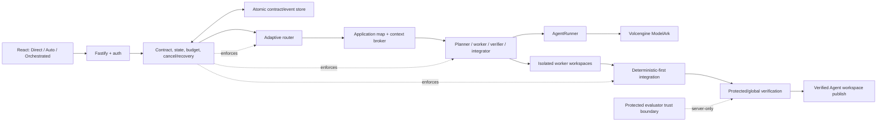
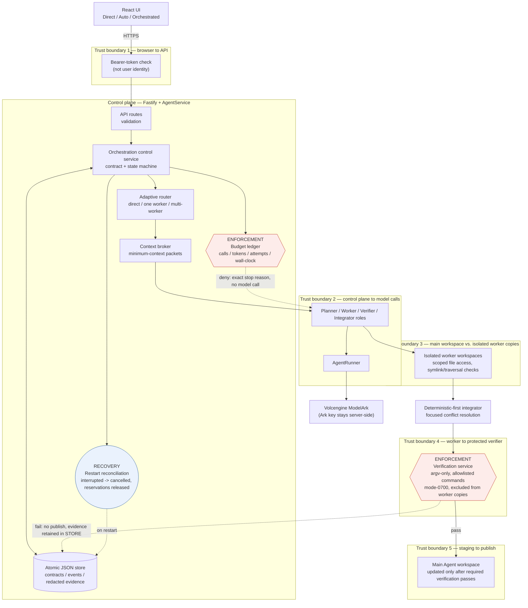

# Architecture

Volc Agent Launchpad is a single-node control plane for hackathon use.





## Components

### Web UI

Lists Agents, manages lifecycle actions, submits prompts, and polls asynchronous
Runs and orchestrations. It renders only persisted, redacted read models and never
receives the Ark key, protected evaluator source, unrestricted environment data,
or worker reasoning transcripts.

### Orchestration control plane

Persists immutable intent/contract versions, explicit confirmation, task state,
events, usage reservations, hard budgets, cancellation, and restart reconciliation.
The execution engine maps the repository, selects a route, gives each worker the
minimum relevant context, performs a read-only preflight, and uses task-specific
workspace copies. Shared coordination happens through versioned artifacts.

Protected and global checks run outside worker authority. Integration is
deterministic for non-overlapping edits; a focused integrator handles remaining
conflicts. The main Agent workspace is updated only after required verification.

### Fastify API

Validates requests, protects remote demos with a shared bearer token, and
serves the compiled Web UI. The token is not user identity or authorization.

### AgentService

Coordinates lifecycle state, persistence, workspaces, and Runs. One Agent can
have only one active Run.

```text
ready -> busy -> ready
  |       |
  v       v
stopped  error
```

Interrupted Runs become `cancelled` after a restart.

### Storage

```text
data/launchpad.json       Agent, message, and Run metadata
workspaces/AgentID/       Agent-created files
workspaces/.deleted/      Archived deleted workspaces
codex-home/               Codex configuration and sessions
```

`JsonStore` serializes writes and atomically replaces one JSON file. It supports
one process only.

### Runtime providers

- `CodexRunner` runs Codex inside the application container for ECS.
- `ContainerCodexRunner` starts one disposable Docker, Colima, or Podman
  container for every local turn.

Both providers use argv-only process execution, bound output and time, resume
the stored Codex thread, and escalate termination after a grace period.

## Deployment profiles

| Profile | Control plane | Agent execution |
| --- | --- | --- |
| Local POC | Host Node.js | Disposable local container |
| ECS | Application container | Codex process in the same container |
| Local development | Host Node.js | Host Codex process |

## Extension seams

| Track | Primary seam | Expected change |
| --- | --- | --- |
| Glass Box | `AgentRunner`, `AgentRun` | Emit and display correlated execution events. |
| Bouncer | API routes, Agent ownership | Add identity and server-side authorization. |
| Kill Switch | `AgentRunner` | Add threat-specific policy or a stronger sandbox. |

The current container or ECS instance is the POC trust boundary. Ordinary
containers are not hardened multi-tenant isolation.
