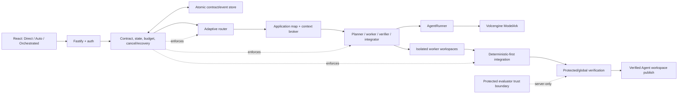

# Architecture

Volc Agent Launchpad is a single-node control plane for hackathon use.



## Components

### Web UI

Lists Agents, manages lifecycle actions, submits prompts, and polls asynchronous
Runs and orchestrations. It renders only persisted, redacted read models and never
receives the Ark key, protected evaluator source, unrestricted environment data,
or worker reasoning transcripts.

### Orchestration control plane

Persists immutable intent/contract versions, explicit confirmation, task state,
events, usage reservations, hard budgets, cancellation, and restart reconciliation.
The execution engine maps the repository, asks the planner for a compact task
graph, and selects direct, sequential, parallel, or hybrid execution without
forcing parallelism. It gives each worker the minimum relevant context,
performs a read-only preflight, and uses task-specific workspace copies. Shared
coordination happens through versioned artifacts.

The scheduler computes conflict-free waves: dependency-ready workers with
non-overlapping write scopes run concurrently, while only colliding writers are
serialized. Each completed wave is applied to a private stage before the next
wave starts, so downstream workers see upstream changes and sequential workers
may safely edit the same path. Protected and global checks run outside worker
authority. Integration replays the same waves deterministically; a focused
integrator handles only unexpected same-wave conflicts. The main Agent workspace
is updated only after required verification.
Verifier model turns run in the disposable Runtime with the candidate mounted
read-only. A bounded temporary filesystem, private shared memory, subprocesses,
loopback sockets, and bundled Chromium provide runtime-test capability without
granting access to the host browser profile or allowing candidate modification.

### Fastify API

Validates requests, protects remote demos with a shared bearer token, and
serves the compiled Web UI. The token is not user identity or authorization.

### AgentService

Coordinates lifecycle state, persistence, workspaces, and Runs. One Agent can
have only one active Run.

```text
ready -> busy -> ready
  |       |
  v       v
stopped  error
```

Interrupted Runs become `cancelled` after a restart.

### Storage

```text
data/launchpad.json       Agent, message, and Run metadata
workspaces/AgentID/       Agent-created files
workspaces/.deleted/      Archived deleted workspaces
codex-home/               Codex configuration and sessions
```

`JsonStore` serializes writes and atomically replaces one JSON file. It supports
one process only.

### Runtime providers

- `CodexRunner` runs Codex inside the application container for ECS.
- `ContainerCodexRunner` starts one disposable Docker, Colima, or Podman
  container for every local turn.

Both providers use argv-only process execution, bound output and time, resume
the stored Codex thread, and escalate termination after a grace period.

## Deployment profiles

| Profile | Control plane | Agent execution |
| --- | --- | --- |
| Local POC | Host Node.js | Disposable local container |
| ECS | Application container | Codex process in the same container |
| Local development | Host Node.js | Disposable browser-capable Runtime container (recommended); host Codex remains an explicit compatibility option |

## Extension seams

| Track | Primary seam | Expected change |
| --- | --- | --- |
| Glass Box | `AgentRunner`, `AgentRun` | Emit and display correlated execution events. |
| Bouncer | API routes, Agent ownership | Add identity and server-side authorization. |
| Kill Switch | `AgentRunner` | Add threat-specific policy or a stronger sandbox. |

The current container or ECS instance is the POC trust boundary. Ordinary
containers are not hardened multi-tenant isolation.
