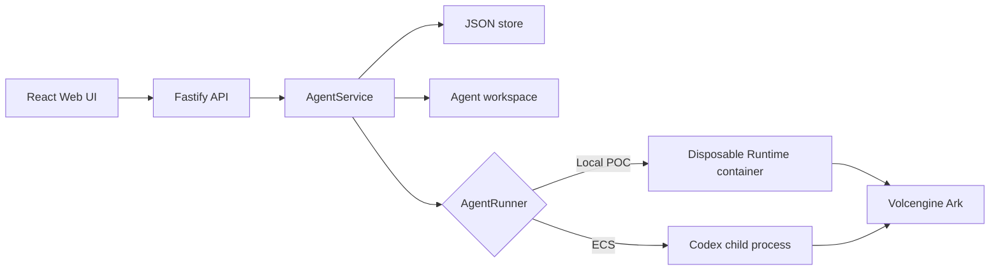
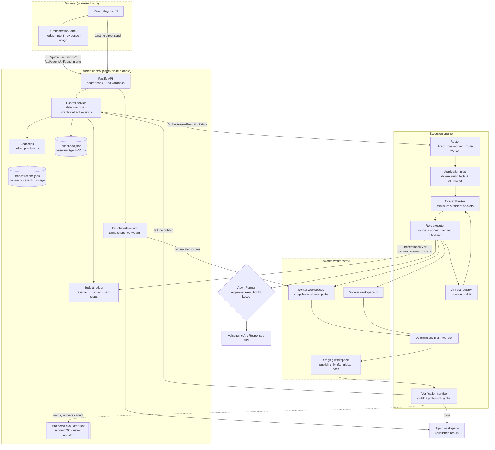

# Architecture

Volc Agent Launchpad is a single-node control plane for hackathon use. The
baseline platform is described first. The orchestration middleware added for
TechJam Track 1 is described in
[Orchestration middleware](#orchestration-middleware), and that section holds
the one-page diagram used for the submission.



## Components

### Web UI

Lists Agents, manages lifecycle actions, submits prompts, and polls asynchronous
Runs. It never receives the Ark API key.

### Fastify API

Validates requests, protects remote demos with a shared bearer token, and
serves the compiled Web UI. The token is not user identity or authorization.

### AgentService

Coordinates lifecycle state, persistence, workspaces, and Runs. One Agent can
have only one active Run.

```text
ready -> busy -> ready
  |       |
  v       v
stopped  error
```

Interrupted Runs become `cancelled` after a restart.

### Storage

```text
data/launchpad.json       Agent, message, and Run metadata
workspaces/AgentID/       Agent-created files
workspaces/.deleted/      Archived deleted workspaces
codex-home/               Codex configuration and sessions
```

`JsonStore` serializes writes and atomically replaces one JSON file. It supports
one process only.

### Runtime providers

- `CodexRunner` runs Codex inside the application container for ECS.
- `ContainerCodexRunner` starts one disposable Docker, Colima, or Podman
  container for every local turn.

Both providers use argv-only process execution, bound output and time, resume
the stored Codex thread, and escalate termination after a grace period.

## Deployment profiles

| Profile | Control plane | Agent execution |
| --- | --- | --- |
| Local POC | Host Node.js | Disposable local container |
| ECS | Application container | Codex process in the same container |
| Local development | Host Node.js | Host Codex process |

## Extension seams

| Track | Primary seam | Expected change |
| --- | --- | --- |
| Glass Box | `AgentRunner`, `AgentRun` | Emit and display correlated execution events. |
| Bouncer | API routes, Agent ownership | Add identity and server-side authorization. |
| Kill Switch | `AgentRunner` | Add threat-specific policy or a stronger sandbox. |

The current container or ECS instance is the POC trust boundary. Ordinary
containers are not hardened multi-tenant isolation.

---

# Orchestration middleware

The middleware treats **model intelligence and context as schedulable Agent
resources**. A powerful planner confirms global intent with the user, then the
control layer routes local work to appropriately priced models with only the
context each one needs, while holding shared contracts, bounded recovery, and
trusted verification.

It sits between the browser and the existing `AgentRunner`. The baseline direct
Playground path is untouched and remains the benchmark baseline.

## One-page diagram

Trust boundaries are drawn as subgraphs. Everything inside **Trusted control
plane** is server-owned and never reachable from a worker or the browser.



## Enforcement, instrumentation, and recovery points

| Point | Where it lives | What it guarantees |
| --- | --- | --- |
| Explicit confirmation | Control state machine | Planning starts only after a user confirms a specific draft revision. |
| Immutable contracts | Contract store | Difficulty never silently weakens a confirmed requirement; changes are versioned amendments needing renewed confirmation. |
| Budget gate | `reserveModelCall` before every model call | A denied reservation stops new work and produces `budget-exhausted`, not an HTTP 500. |
| Redaction | Before persistence, again before rendering | Keys, bearer tokens, and credential assignments never reach disk, API, or DOM. |
| Context minimization | Context broker | Workers receive paths, hashes, and only the files they need; expansion is narrow, budgeted, and recorded. |
| Worker isolation | Per-task workspace snapshots | No two workers mutate one directory, and scope violations are attributable. |
| Protected verification | Evaluator root at mode 0700 | A worker can read a criterion description but never the implementation, and cannot mark itself passed. |
| Deterministic-first integration | Integrator | Non-overlapping changes merge without a model; only true conflicts reach one. |
| Publication gate | Staging workspace | Failed global verification leaves the main Agent workspace unchanged. |
| Cancellation and restart | `AbortController` per orchestration, reconciliation at boot | Interrupted work becomes `cancelled` with a reason; it is never reported as success. |
| Benchmark fairness | Benchmark service | Two copies of one snapshot, identical prompt and criteria, no cross-arm leakage, cost withheld unless quality matches. |

## Module map

```text
apps/server/src/orchestration/contracts.ts       frozen cross-module contract
apps/server/src/orchestration/control/           state, store, redaction, budget, routes
apps/server/src/orchestration/engine/            router, map, broker, roles, verify, integrate
apps/server/src/orchestration/benchmark/         direct-vs-orchestrated service and routes

apps/web/src/orchestration/contracts.ts          browser DTOs aligned with the frozen contract
apps/web/src/orchestration/api-port.ts           OrchestrationApi (injected; no fetch inside the module)
apps/web/src/orchestration/view-model.ts         the only unknown -> DTO conversion layer
apps/web/src/orchestration/polling.ts            terminal stop, backoff, duplicate-loop prevention
apps/web/src/orchestration/OrchestrationPanel.tsx
apps/web/src/orchestration/components/           mode, intent, plan, timeline, usage, benchmark
apps/web/src/orchestration/orchestration.css     scoped styles that extend styles.css
```

## Storage

Orchestration state is kept **separate** from the baseline database so existing
behaviour is unaffected:

```text
data/launchpad.json                 Agents, messages, Runs (baseline, unchanged)
data/orchestrations.json            orchestrations, contracts, events, usage
data/orchestration/temp/            per-task worker snapshots and benchmark copies
data/orchestration/archive/         retained worker state per cleanup policy
data/protected-evaluators/          protected checks, mode 0700, never mounted
```

Both stores serialize mutations and write through a mode-0600 temporary file
plus an atomic rename. They support one server process. PostgreSQL with leases
is the documented production evolution for multi-process execution; it is
deliberately not built here.

## Browser boundary

`OrchestrationPanel` is injected with an `OrchestrationApi` adapter and never
calls `fetch` itself, so the module compiles and tests without the server. Every
server payload is `unknown` until it passes through `view-model.ts`, which is
the single place that narrows types, drops forbidden fields (reasoning,
protected source, secrets, environment dumps), bounds text length, and shortens
absolute filesystem paths. Components receive already-safe data.
