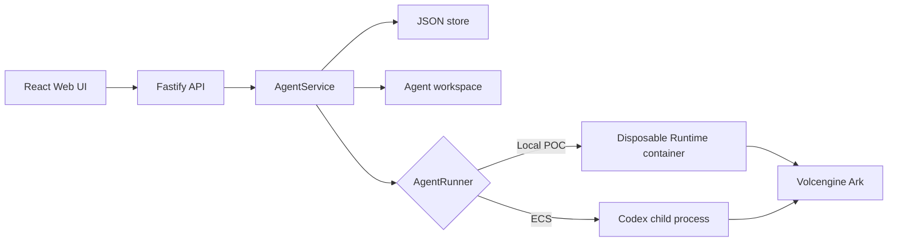
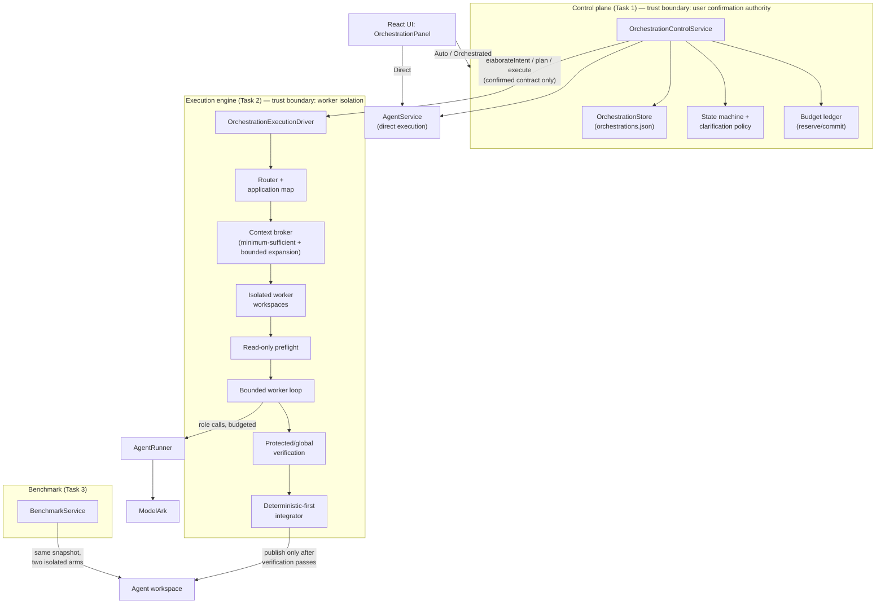

# Architecture

Volc Agent Launchpad is a single-node control plane for hackathon use.



## Components

### Web UI

Lists Agents, manages lifecycle actions, submits prompts, and polls asynchronous
Runs. It never receives the Ark API key.

### Fastify API

Validates requests, protects remote demos with a shared bearer token, and
serves the compiled Web UI. The token is not user identity or authorization.

### AgentService

Coordinates lifecycle state, persistence, workspaces, and Runs. One Agent can
have only one active Run.

```text
ready -> busy -> ready
  |       |
  v       v
stopped  error
```

Interrupted Runs become `cancelled` after a restart.

### Storage

```text
data/launchpad.json       Agent, message, and Run metadata
workspaces/AgentID/       Agent-created files
workspaces/.deleted/      Archived deleted workspaces
codex-home/               Codex configuration and sessions
```

`JsonStore` serializes writes and atomically replaces one JSON file. It supports
one process only.

### Runtime providers

- `CodexRunner` runs Codex inside the application container for ECS.
- `ContainerCodexRunner` starts one disposable Docker, Colima, or Podman
  container for every local turn.

Both providers use argv-only process execution, bound output and time, resume
the stored Codex thread, and escalate termination after a grace period.

## Deployment profiles

| Profile | Control plane | Agent execution |
| --- | --- | --- |
| Local POC | Host Node.js | Disposable local container |
| ECS | Application container | Codex process in the same container |
| Local development | Host Node.js | Host Codex process |

## Extension seams

| Track | Primary seam | Expected change |
| --- | --- | --- |
| Glass Box | `AgentRunner`, `AgentRun` | Emit and display correlated execution events. |
| Bouncer | API routes, Agent ownership | Add identity and server-side authorization. |
| Kill Switch | `AgentRunner` | Add threat-specific policy or a stronger sandbox. |

The current container or ECS instance is the POC trust boundary. Ordinary
containers are not hardened multi-tenant isolation.

## Orchestration middleware (Track 1)

The orchestration layer sits between the Web UI and `AgentRunner`, adding a
grounding/confirmation control plane and a context-aware execution engine.
It does not replace anything above — direct Playground chat is unchanged —
it adds a second, budgeted path for delegated work.



### Data flow and trust boundaries

1. **UI → Control plane.** The browser never decides whether intent is
   grounded — `OrchestrationControlService` is the sole authority on
   confirmation. A material clarification question always blocks
   confirmation server-side, regardless of what the UI shows.
2. **Control plane → Engine.** `plan()`/`execute()` require an already
   confirmed `ExecutionContract` (enforced at the type level, not just by
   convention) — the engine cannot begin work on an unconfirmed
   interpretation.
3. **Engine → Runner.** Every model call is budget-reserved through the
   sink before it happens; a denied reservation stops the call, not just
   the accounting. Workers run against isolated workspace copies, never the
   real Agent workspace directly.
4. **Engine → Workspace (publish).** Only the deterministic-first
   integrator writes back to the real Agent workspace, and only after
   protected/global verification passes on a staged candidate. Main-
   workspace drift (a human edited it mid-flight) halts instead of
   overwriting.

### Enforcement / instrumentation / recovery points

| Point | What it does |
| --- | --- |
| `clarification-policy.ts` | Deterministically decides which questions actually block confirmation. |
| `budget-ledger.ts` | Pure reserve/commit functions; denies before spend, not just measures after. |
| `state-machine.ts` | The canonical status graph; illegal transitions throw (409), never silently proceed. |
| `worker-workspaces.ts` | Isolated copies + safe cleanup (refuses to delete outside the trusted scratch root). |
| `verification.ts` | Worker-visible checks help iteration; only protected/global checks gate publish, run via a trusted command allowlist (never an arbitrary shell string). |
| `integrator.ts` | Deterministic merge for non-conflicting files; focused (not full-transcript) model calls only for genuine conflicts; drift detection halts rather than overwrites. |
| `redaction.ts` | Applied before persistence, not just at response time. |
| `OrchestrationControlService.cancelOrchestration` | Immediate and authoritative; never blocks on a driver ignoring its abort signal. |
| `initialize()` restart reconciliation | Marks interrupted work `cancelled`, never reports it as succeeded. |

Full detail, deviations from Appendix A, and every deliberate scope
decision: `docs/handoffs/task-1-control-plane.md`,
`docs/handoffs/task-2-engine.md`, `docs/handoffs/task-3-experience-evidence.md`.
